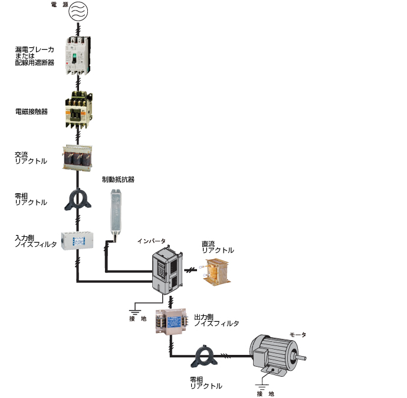
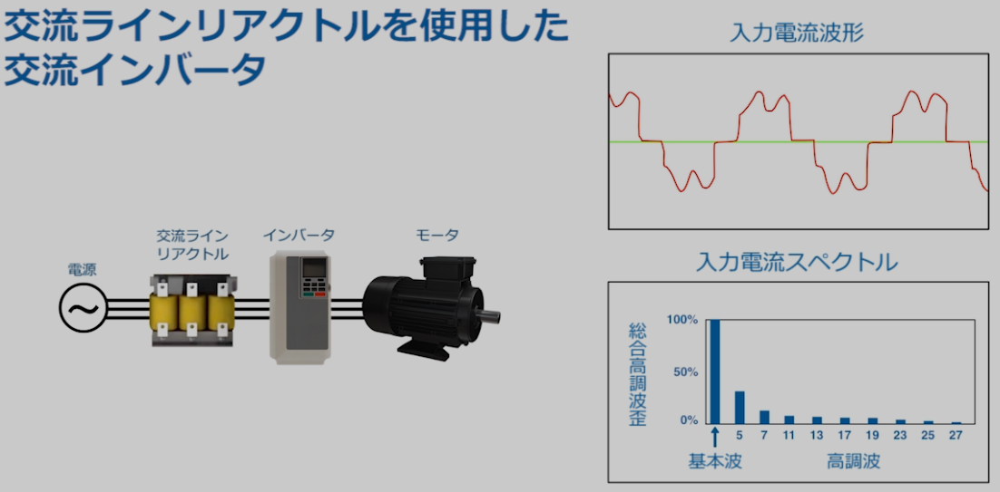
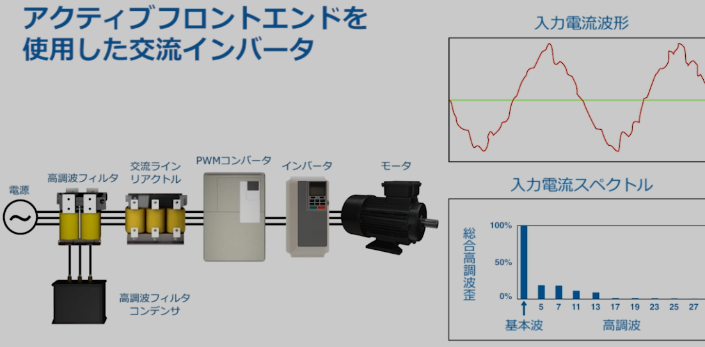
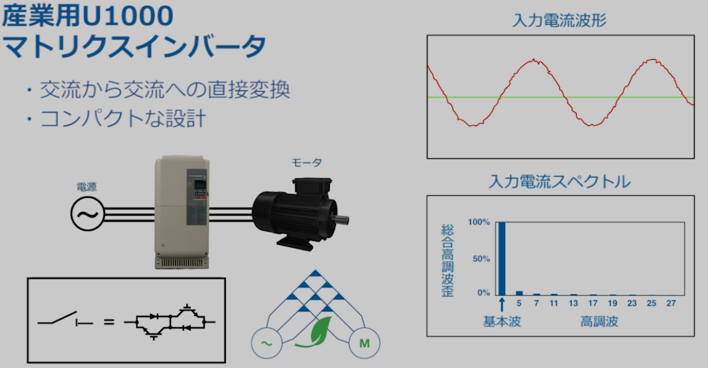
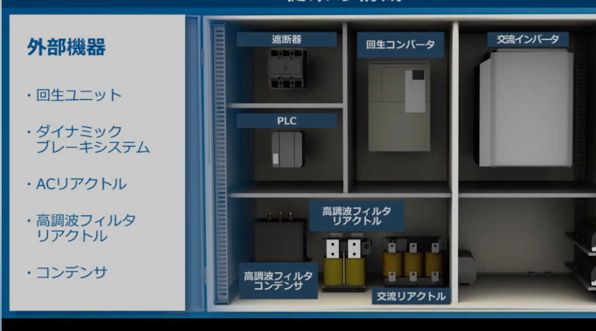
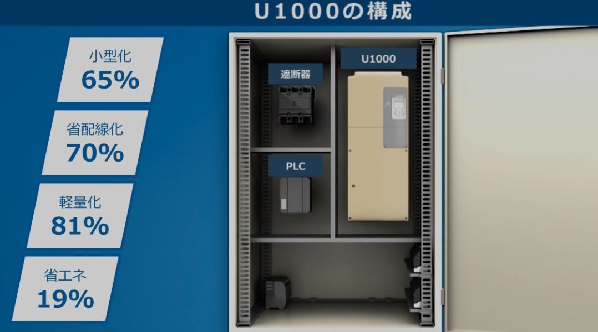

#インバータ

#インバータ接続図  

#高周波歪  
交流インバータを仕様した際、高周波が発生する。
高周波を抑制するために、リアクタンス（インピーダンス)を接続する  

#リアクタンス  
・ノイズ除去、高周波除去  
・コンデンサは電流 リアクタンスは電圧  
・リアクタンスは絶縁コイル  

  
  

#インバータ　インターフェース  
RS-485  

#交流<->交流変換  
  

#ユニット構成  
・従来  

・ユニット化  

