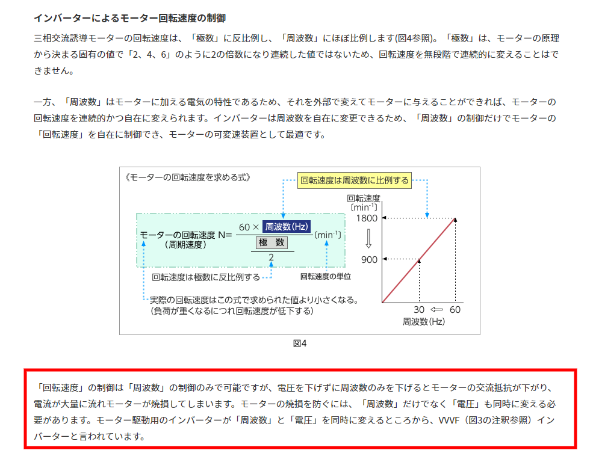
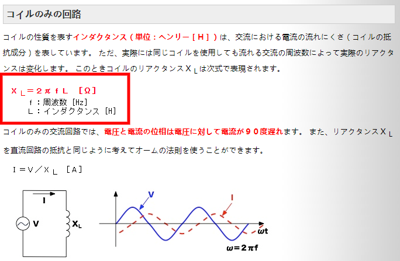

## 交流の電源周波数と回転速度について    
交流の電源周波数とﾓｰﾀの回転速度は、極数、電源周波数、周波数の値で決まる。  

## 交流ﾓｰﾀの焼損について  
交流ﾓｰﾀは、上図赤枠の通り、電源を下げずに周波数のみを下げると、ﾓｰﾀの交流抵抗が下がり、電流が大量にﾓｰﾀに流れ焼損してしまう。  

詳細は、下図の式の通りである。  
周波数が下がると、交流抵抗(ﾘｱｸﾀﾝｽ)が下がり、ﾓｰﾀに流れる電流が増える。結果焼損の恐れがあることになる。  
  
