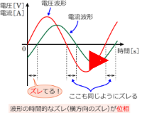

### 定格とは
機器の使用条件または限度を表した数字。
「定格電圧Vが100〔V〕、定格出力が5〔kW〕の分巻電動機がある」という文章が出てきたら、この分巻電動機は「電圧100〔V〕、出力5〔kW〕で運転する機械である」という意味。


### 定格電流  

```math
定格容量[VA] = √3*定格電流[A]*定格電圧[V]*力率
```


### 交流の電力
```math
P=VIcosθ[W]
```


### 力率cosΘ
1. 皮相電力S(電源から送られる電力)のうち有効電力P(負荷で実際に消費される電力)として取り出せる割合がどれくらいかを表す指標
2. 力率cosθは「電圧に対して電流がどれだけ遅れているかor進んでいるか」を数値化した指標にもなる。力率cosθが1に近づくほど、電圧と電流の位相差が小さいことを示す。

- ベクトルの関係が成り立つ  
皮相電力と有効電力がなす角度のcos値が力率。

```math
有効電力 P [W]⋯負荷で実際に消費される電力
VIcosΘ [VA]
皮相電力 S [VA]⋯電源から送られる電力
VI [VA]
無効電力 Q [var]⋯電力を消費しない分の電力
VIsinΘ [VA]
```

- 電圧と電流の位相差θ[rad]の余弦(cos)が力率
  


### 電動機の種類
- 三相誘導電動機
  三相モータというと大体これ。

- 三相同期電動機  
  電源周波数[Hz]に同期して回転する
- 三相同期電動機


### 極数
モータをシャフトに対して垂直に切った面に現れる、磁極（NSNSNS……）の数のこと  
基本的には、極数は偶数（2,4,6,8……）

